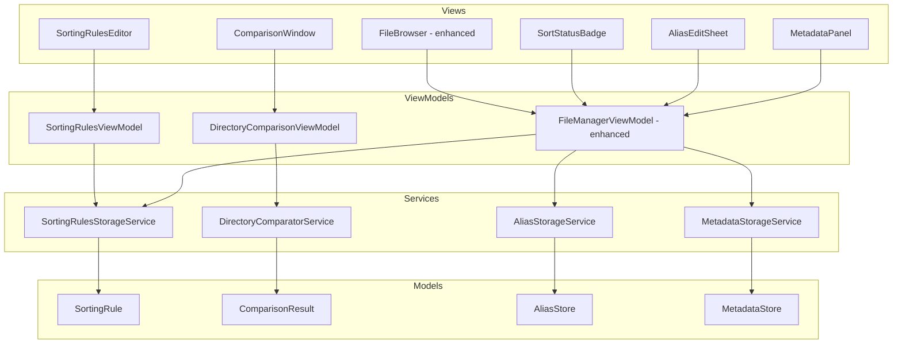

# Design Document: Enhanced File Management

## Overview

This design introduces four integrated capabilities into RetroFilesystemGUI: **sorting rules with unsorted file detection**, **directory comparison**, **file alias names**, and a **JSON metadata panel with editing**. These features extend the existing MVVM architecture, adding new services, models, and view components while preserving the established patterns (protocol-based services, `@Observable` view models, JSON persistence in `~/Library/Application Support/RetroFilesystemGUI/`).

The design maintains backward compatibility with existing persistence files (tags.json, smart_folders.json) and integrates naturally with the existing `FileSystemWatcher` polling mechanism, `FileBrowser` view mode system, and `NavigationPanel` sidebar.

## Architecture

The new features layer onto the existing architecture:



### Design Decisions

1. **Separate storage services per feature**: Each new JSON file gets its own service conforming to a protocol, matching the existing `TagStorageService` / `SmartFolderStorageService` pattern. This keeps services focused and testable.

2. **Extend FileManagerViewModel rather than creating new VMs for aliases/metadata**: Since aliases and metadata affect how files are displayed and interact with selection state, they belong in the existing `FileManagerViewModel`. Only sorting rules and directory comparison get dedicated VMs because they have their own editor/window UI flows.

3. **Unsorted file evaluation is lazy and cached**: We compute unsorted counts when a directory is loaded or refreshed (via the existing 3s watcher), not on every render. Counts are stored in a dictionary keyed by directory path.

4. **Directory comparison is a one-shot operation**: It produces an immutable `ComparisonResult` displayed in a separate window. No persistent state is needed.

5. **Metadata panel reuses TextEditor**: Rather than building a custom JSON editor, we use a `TextEditor` with monospace font and validate on save. This is simple and aligns with the "retro" aesthetic.

## Components and Interfaces

### New Protocols

```swift
/// Protocol for sorting rules persistence.
protocol SortingRulesStorageServiceProtocol {
    func load() throws -> SortingRulesStore
    func save(_ store: SortingRulesStore) throws
}

/// Protocol for alias persistence.
protocol AliasStorageServiceProtocol {
    func load() throws -> AliasStore
    func save(_ store: AliasStore) throws
}

/// Protocol for metadata persistence.
protocol MetadataStorageServiceProtocol {
    func load() throws -> MetadataStore
    func save(_ store: MetadataStore) throws
}

/// Protocol for directory comparison logic.
protocol DirectoryComparatorServiceProtocol {
    func compare(
        directory1: URL,
        directory2: URL,
        fileSystemService: FileSystemServiceProtocol
    ) throws -> ComparisonResult
}
```

### New ViewModels

```swift
/// Manages sorting rules creation, editing, and deletion for a specific directory.
@Observable
class SortingRulesViewModel {
    var rules: [SortingRule] = []
    var editingRule: SortingRule?
    var validationError: String?
    let directoryPath: String
    private let storageService: SortingRulesStorageServiceProtocol
}

/// Manages directory comparison state and results.
@Observable
class DirectoryComparisonViewModel {
    var comparisonResult: ComparisonResult?
    var isComparing: Bool = false
    var errorMessage: String?
    private let comparatorService: DirectoryComparatorServiceProtocol
    private let fileSystemService: FileSystemServiceProtocol
}
```

### Extensions to FileManagerViewModel

```swift
extension FileManagerViewModel {
    // Alias support
    var aliasStore: AliasStore  // loaded on init
    func setAlias(for path: String, name: String) -> Result<Void, AliasValidationError>
    func removeAlias(for path: String)
    func displayName(for item: FileItem) -> String
    func isAliased(_ item: FileItem) -> Bool

    // Metadata panel support
    var metadataPanelVisible: Bool
    var selectedItemMetadata: String  // pretty-printed JSON text
    var metadataValidationError: String?
    var previousMetadataState: String?  // for single-level undo
    func loadMetadata(for path: String)
    func saveMetadata(jsonText: String, for path: String) -> Result<Void, MetadataValidationError>
    func undoMetadata(for path: String)

    // Unsorted files support
    var unsortedCounts: [String: Int]  // directory path -> unsorted count
    var unsortedFilterActive: Bool
    func evaluateUnsortedFiles(in directory: URL)
    func toggleUnsortedFilter(for directory: URL)
}
```

### New Views

| View | Purpose |
|------|---------|
| `SortingRulesEditor` | Sheet for managing sorting rules for a directory |
| `SortStatusBadge` | Overlay badge showing unsorted count on directory items |
| `ComparisonWindow` | Standalone window displaying comparison results |
| `AliasEditSheet` | Small popover/sheet for assigning/editing an alias |
| `MetadataPanel` | Side panel (200–400pt wide) showing JSON metadata |

## Data Models

### SortingRule & SortingRulesStore

```swift
/// A rule type that determines how files are matched.
enum SortingRuleType: String, Codable {
    case fileExtension   // matches file extension (without dot), 1–20 chars
    case namePattern     // glob pattern matching, 1–255 chars
    case tag             // matches files with a specific tag ID
}

/// A single sorting rule for a directory.
struct SortingRule: Identifiable, Codable, Equatable {
    let id: UUID
    var ruleType: SortingRuleType
    var pattern: String       // extension string, glob pattern, or tag UUID string
    var createdDate: Date
}

/// Associates a directory path with its sorting rules.
struct DirectorySortingRules: Codable, Equatable {
    let directoryPath: String
    var rules: [SortingRule]  // max 50 per directory
}

/// Top-level store for all sorting rules.
struct SortingRulesStore: Codable, Equatable {
    var directories: [DirectorySortingRules]
}
```

### ComparisonResult

```swift
/// Result of comparing two directories.
struct ComparisonResult: Equatable {
    let directory1Name: String
    let directory2Name: String
    let directory1URL: URL
    let directory2URL: URL
    let uniqueToFirst: [ComparisonItem]
    let uniqueToSecond: [ComparisonItem]
    let inBoth: [ComparisonItem]
}

/// A single item in a comparison result.
struct ComparisonItem: Identifiable, Equatable {
    let id: UUID
    let name: String
    let size: Int64
    let modificationDate: Date
    let isDirectory: Bool
    let sourceURL: URL
}
```

### AliasStore

```swift
/// Maps file paths to their alias display names.
struct AliasStore: Codable, Equatable {
    /// Dictionary: file absolute path -> alias name string
    var aliases: [String: String]
}
```

### MetadataStore

```swift
/// Represents an arbitrary JSON value for metadata storage.
enum JSONValue: Codable, Equatable {
    case null
    case bool(Bool)
    case int(Int)
    case double(Double)
    case string(String)
    case array([JSONValue])
    case object([String: JSONValue])
}

/// Maps file paths to their JSON metadata.
struct MetadataStore: Codable, Equatable {
    /// Dictionary: file absolute path -> JSON metadata value
    var entries: [String: JSONValue]
}
```

### Validation Types

```swift
enum AliasValidationError: Error, Equatable {
    case empty
    case tooLong            // exceeds 255 characters
    case containsSlash
    case containsColon
}

enum MetadataValidationError: Error, Equatable {
    case malformedJSON(line: Int, character: Int)
    case tooLarge           // exceeds 1 MB
}

enum SortingRuleValidationError: Error, Equatable {
    case emptyPattern
    case patternTooLong     // extension > 20, name pattern > 255
    case maxRulesReached    // 50 per directory
}
```


## Correctness Properties

*A property is a characteristic or behavior that should hold true across all valid executions of a system — essentially, a formal statement about what the system should do. Properties serve as the bridge between human-readable specifications and machine-verifiable correctness guarantees.*

### Property 1: SortingRulesStore round-trip

*For any* valid `SortingRulesStore` instance (containing arbitrary directories with up to 50 rules each, where each rule has a valid type and pattern), encoding with `JSONEncoder` then decoding with `JSONDecoder` SHALL produce a `SortingRulesStore` that is equal to the original as determined by Swift `Equatable` conformance.

**Validates: Requirements 1.2, 7.1**

### Property 2: Unsorted file evaluation correctness

*For any* directory with one or more `SortingRule` entries and *for any* set of files in that directory, a file SHALL be classified as unsorted if and only if it matches none of the directory's sorting rules (where matching is: extension rule matches the file's extension case-insensitively, name pattern rule matches via glob, tag rule matches if the file has the specified tag). If a directory has zero sorting rules, all files SHALL be classified as sorted.

**Validates: Requirements 1.3, 2.2, 2.6**

### Property 3: Sorting rule cap invariant

*For any* sequence of sorting rule additions to a single directory, the service SHALL reject any addition that would cause the directory to exceed 50 rules, and the resulting store SHALL never contain more than 50 rules for any single directory.

**Validates: Requirements 1.3**

### Property 4: Invalid sorting rule pattern rejection

*For any* string that is empty, or exceeds 20 characters when the rule type is `fileExtension`, or exceeds 255 characters when the rule type is `namePattern`, the validation function SHALL return an appropriate error and the rule SHALL NOT be persisted.

**Validates: Requirements 1.6**

### Property 5: Directory comparison three-way partition

*For any* two sets of file names (representing the immediate children of two directories), the `DirectoryComparatorService` SHALL produce a `ComparisonResult` where: (a) `uniqueToFirst` contains exactly those names present in directory 1 but not directory 2 (case-sensitive), (b) `uniqueToSecond` contains exactly those names present in directory 2 but not directory 1, (c) `inBoth` contains exactly those names present in both directories, and (d) the union of all three sets equals the union of both input sets with no duplicates within any category.

**Validates: Requirements 3.1, 3.2**

### Property 6: AliasStore round-trip

*For any* valid `AliasStore` instance (containing a dictionary of arbitrary file path strings mapped to valid alias name strings of 1–255 characters without '/' or ':'), encoding with `JSONEncoder` then decoding with `JSONDecoder` SHALL produce an `AliasStore` that is equal to the original.

**Validates: Requirements 4.9, 7.2, 7.4, 7.8**

### Property 7: Display name resolution

*For any* file item and *for any* `AliasStore` state, the `displayName` function SHALL return the alias name if the file's path exists as a key in the alias store, and SHALL return the file's filesystem name otherwise. Furthermore, assigning an alias then removing it SHALL result in `displayName` returning the filesystem name again (round-trip to original state).

**Validates: Requirements 4.2, 4.4**

### Property 8: Invalid alias name rejection

*For any* string that is empty, exceeds 255 characters, or contains the character '/' or ':', the alias validation function SHALL return an appropriate `AliasValidationError` and the alias SHALL NOT be persisted to the store.

**Validates: Requirements 4.8**

### Property 9: Stale alias cleanup

*For any* `AliasStore` containing N alias entries, after a directory refresh where M of those paths still exist on disk (0 ≤ M ≤ N), the resulting store SHALL contain exactly M entries corresponding to the paths that still exist, and all entries for non-existent paths SHALL be removed.

**Validates: Requirements 4.6**

### Property 10: MetadataStore round-trip

*For any* valid `MetadataStore` instance (containing a dictionary of file path strings mapped to arbitrary JSON values including nested objects and arrays), encoding with `JSONEncoder` then decoding with `JSONDecoder` SHALL produce a `MetadataStore` that is equal to the original.

**Validates: Requirements 6.6, 7.1, 7.3, 7.7**

### Property 11: Metadata save then undo restores previous state

*For any* initial metadata value V1 associated with a file path, and *for any* valid replacement metadata value V2, saving V2 then invoking undo SHALL restore the metadata for that path to V1. If no prior state exists (first save), undo SHALL be disabled.

**Validates: Requirements 6.4**

### Property 12: Stale metadata cleanup

*For any* `MetadataStore` containing N entries, after a directory refresh where M of those paths still exist on disk (0 ≤ M ≤ N), the resulting store SHALL contain exactly M entries corresponding to the paths that still exist.

**Validates: Requirements 6.7**

### Property 13: Path truncation for metadata panel header

*For any* file path string, the truncation function SHALL: (a) return the path unchanged if its length is ≤ 80 characters, (b) return a string of exactly 80 characters starting with "…" if the original path exceeds 80 characters, preserving the rightmost characters of the path.

**Validates: Requirements 5.6**

### Property 14: Badge text formatting

*For any* non-negative integer count, the badge formatting function SHALL return the string representation of the number if count is between 1 and 99 inclusive, "99+" if count exceeds 99, and an empty/nil value if count is 0.

**Validates: Requirements 2.1**

### Property 15: Sorting rule deletion

*For any* `SortingRulesStore` containing a rule with a given ID in a given directory, deleting that rule SHALL produce a store where (a) the rule count for that directory is exactly one less than before, (b) no rule with that ID exists in the directory, and (c) all other rules remain unchanged.

**Validates: Requirements 1.4**

## Error Handling

### Storage Errors (All JSON Persistence Files)

| Condition | Behavior |
|-----------|----------|
| File missing on load | Create empty file with default empty store, log warning via `os.Logger` |
| File contains malformed JSON | Log descriptive error with file path, return empty store |
| Write fails (permissions, disk full) | Propagate error to ViewModel, display user-facing error alert, preserve existing file unchanged |
| Atomic write interrupted | No corruption — `.atomic` write option ensures complete-or-nothing semantics |

### Alias Validation Errors

| Input Condition | Error Type | User Message |
|-----------------|-----------|--------------|
| Empty string | `.empty` | "Alias name cannot be empty" |
| Exceeds 255 characters | `.tooLong` | "Alias name must be 255 characters or fewer" |
| Contains '/' | `.containsSlash` | "Alias name cannot contain '/'" |
| Contains ':' | `.containsColon` | "Alias name cannot contain ':'" |

### Metadata Validation Errors

| Input Condition | Error Type | User Message |
|-----------------|-----------|--------------|
| Malformed JSON | `.malformedJSON(line:character:)` | "Invalid JSON at line X, character Y" |
| Content exceeds 1 MB | `.tooLarge` | "Metadata must be smaller than 1 MB" |

### Sorting Rule Validation Errors

| Input Condition | Error Type | User Message |
|-----------------|-----------|--------------|
| Empty pattern | `.emptyPattern` | "Rule pattern cannot be empty" |
| Extension > 20 chars or name pattern > 255 chars | `.patternTooLong` | "Pattern exceeds maximum length" |
| Directory already has 50 rules | `.maxRulesReached` | "Maximum of 50 rules per directory reached" |

### Directory Comparison Errors

| Condition | Behavior |
|-----------|----------|
| Not exactly 2 directories selected | Show alert: "Please select exactly two directories to compare" |
| Permission denied on either directory | Show alert naming the inaccessible directory, no partial result produced |
| Directory no longer exists | Show alert: "Directory [name] no longer exists" |

### Metadata Panel Errors

| Condition | Behavior |
|-----------|----------|
| MetadataStore unreadable | Show "Metadata unavailable" in panel, treat all items as having no metadata |
| Unsaved changes on selection change | Show confirmation dialog: Save / Discard / Cancel |

## Testing Strategy

### Property-Based Testing

**Library**: Swift's built-in `Testing` framework with manual randomized loops (matching existing project pattern from `RenameRuleTests.swift`).

**Configuration**: Each property test runs a minimum of 100 iterations with randomized inputs.

**Tag format**: Each test is annotated with a comment: `// Feature: enhanced-file-management, Property N: [property text]`

Properties to implement as PBT:
1. SortingRulesStore round-trip (Property 1)
2. Unsorted file evaluation (Property 2)
3. Sorting rule cap invariant (Property 3)
4. Invalid sorting rule pattern rejection (Property 4)
5. Directory comparison partition (Property 5)
6. AliasStore round-trip (Property 6)
7. Display name resolution (Property 7)
8. Invalid alias rejection (Property 8)
9. Stale alias cleanup (Property 9)
10. MetadataStore round-trip (Property 10)
11. Metadata undo (Property 11)
12. Stale metadata cleanup (Property 12)
13. Path truncation (Property 13)
14. Badge formatting (Property 14)
15. Sorting rule deletion (Property 15)

### Unit Tests (Example-Based)

Focus on:
- UI state transitions (panel toggle, filter toggle, comparison window sections)
- Error handling edge cases (malformed files, permission errors, disk full)
- Integration with existing FileSystemWatcher for re-evaluation triggers
- Specific formatting examples (size formatting, date locale)

### Integration Tests

- File system watcher triggers re-evaluation of unsorted status within 5 seconds
- Large directory comparison (>10,000 items) shows progress indicator
- Metadata panel updates within 500ms on selection change
- Atomic write behavior on interruption

### Test File Organization

```
Tests/RetroFilesystemGUITests/
├── SortingRulesStoreTests.swift       (Properties 1, 3, 4, 15)
├── UnsortedEvaluationTests.swift      (Property 2)
├── DirectoryComparisonTests.swift     (Property 5)
├── AliasStoreTests.swift              (Properties 6, 7, 8, 9)
├── MetadataStoreTests.swift           (Properties 10, 11, 12)
├── PathTruncationTests.swift          (Property 13)
├── BadgeFormattingTests.swift         (Property 14)
└── Integration/
    ├── WatcherIntegrationTests.swift
    └── ComparisonPerformanceTests.swift
```
