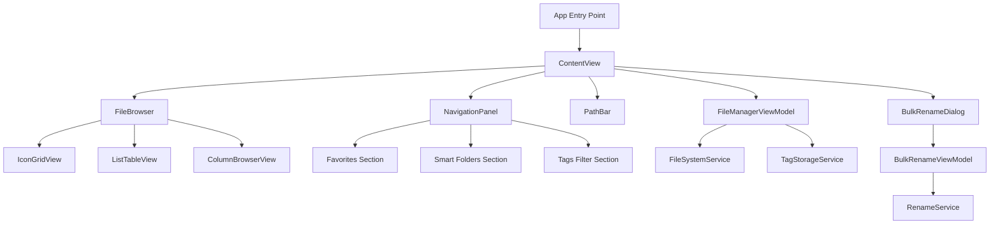

# Design Document: Finder-Enhanced File Manager

## Overview

This design describes a macOS Finder-like file manager application built with SwiftUI targeting macOS 14+. The application provides directory browsing with sidebar navigation, multiple view modes (icon grid, list, column), standard file operations (move, copy, delete, rename, new folder), Smart Folders based on tag/metadata criteria, a full tag management and assignment system, a bulk rename tool with live preview and atomic operations, and persistent JSON-based tag storage with round-trip correctness.

The application follows SwiftUI's declarative UI paradigm with an MVVM architecture. Core logic (file system access, tag persistence, rename operations) lives in dedicated service/model layers that are testable independently of the UI.

## Architecture

The application is structured into four layers:

```
┌─────────────────────────────────────────────────────┐
│                   UI Layer (SwiftUI Views)           │
│  NavigationPanel │ FileBrowser │ BulkRenameDialog    │
├─────────────────────────────────────────────────────┤
│              ViewModel Layer (ObservableObject)       │
│  FileManagerVM │ TagManagerVM │ BulkRenameVM         │
├─────────────────────────────────────────────────────┤
│              Service Layer                           │
│  FileSystemService │ TagStorageService │ RenameService│
├─────────────────────────────────────────────────────┤
│              Model Layer                            │
│  FileItem │ Tag │ SmartFolder │ RenameRule           │
└─────────────────────────────────────────────────────┘
```

### Design Decisions

1. **MVVM with SwiftUI** — ViewModels are `@Observable` classes (macOS 14 Observation framework) that expose published state for views to bind to. This keeps views declarative and logic testable.

2. **Service layer for I/O** — All file system access, tag persistence, and rename operations go through protocol-defined services. This enables mock injection for testing.

3. **NavigationStack for history** — Back/forward navigation uses an explicit history stack managed by the FileManagerViewModel rather than SwiftUI's NavigationStack, because we need custom back/forward behavior.

4. **JSON file for tag persistence** — Tags and associations are stored in a single JSON file at `~/Library/Application Support/RetroFilesystemGUI/tags.json`. Simple, human-readable, and supports the round-trip correctness property.

5. **Atomic bulk rename** — Renames are staged in a transaction list. The operation proceeds only if all validations pass. If any rename fails mid-operation, previously completed renames are reverted using stored original paths.



## Components and Interfaces

### Models

```swift
struct FileItem: Identifiable, Hashable {
    let id: UUID
    let url: URL
    let name: String
    let isDirectory: Bool
    let size: Int64
    let modificationDate: Date
    let creationDate: Date
    let kind: String // UTI-derived display string
    let isHidden: Bool
}

struct Tag: Identifiable, Codable, Equatable {
    let id: UUID
    var name: String
    var color: TagColor
}

enum TagColor: String, Codable, CaseIterable {
    case red, orange, yellow, green, blue, purple, gray, pink
}

struct TagAssociation: Codable, Equatable {
    let filePath: String
    let tagId: UUID
}

struct TagStore: Codable, Equatable {
    var tags: [Tag]
    var associations: [TagAssociation]
}

struct SmartFolder: Identifiable, Codable {
    let id: UUID
    var name: String
    var criteria: SmartFolderCriteria
}

struct SmartFolderCriteria: Codable {
    var requiredTagIds: [UUID]
    var fileType: String?         // UTI filter, nil = any
    var dateRangeStart: Date?
    var dateRangeEnd: Date?
}

enum ViewMode: String, Codable {
    case iconGrid
    case list
    case column
}

enum RenameRule {
    case findReplace(find: String, replace: String)
    case sequentialNumbering(position: Position, start: Int, padding: Int)
    case dateInsertion(position: Position, dateSource: DateSource, format: String)
    
    enum Position { case prepend, append }
    enum DateSource { case creation, modification }
}
```

### ViewModels

```swift
@Observable
class FileManagerViewModel {
    // State
    var currentDirectory: URL
    var fileItems: [FileItem]
    var selectedItems: Set<FileItem.ID>
    var viewMode: ViewMode
    var sortColumn: SortColumn
    var sortAscending: Bool
    var errorMessage: String?
    
    // Navigation history
    private var backStack: [URL]
    private var forwardStack: [URL]
    var canGoBack: Bool { !backStack.isEmpty }
    var canGoForward: Bool { !forwardStack.isEmpty }
    
    // Services
    private let fileSystemService: FileSystemServiceProtocol
    private let tagStorageService: TagStorageServiceProtocol
    
    func navigateTo(_ url: URL)
    func goBack()
    func goForward()
    func deleteSelected()
    func moveItems(_ items: [FileItem], to destination: URL)
    func copyItems(_ items: [FileItem], to destination: URL)
    func createNewFolder()
    func renameItem(_ item: FileItem, to newName: String) -> Result<Void, RenameError>
}

@Observable
class TagManagerViewModel {
    var tags: [Tag]
    var associations: [TagAssociation]
    var errorMessage: String?
    
    private let storageService: TagStorageServiceProtocol
    
    func createTag(name: String, color: TagColor) -> Result<Tag, TagError>
    func editTag(id: UUID, name: String?, color: TagColor?) -> Result<Void, TagError>
    func deleteTag(id: UUID)
    func assignTag(_ tagId: UUID, to filePaths: [String])
    func removeTag(_ tagId: UUID, from filePaths: [String])
    func tagsForFile(_ filePath: String) -> [Tag]
    func filesMatchingTags(_ tagIds: [UUID]) -> [String]
}

@Observable
class BulkRenameViewModel {
    var selectedFiles: [FileItem]
    var rule: RenameRule?
    var previews: [(original: String, result: String, hasConflict: Bool)]
    var canConfirm: Bool
    var errorMessage: String?
    
    private let renameService: RenameServiceProtocol
    
    func updatePreview()
    func confirm() -> Result<Void, BulkRenameError>
    func undo() -> Result<Void, BulkRenameError>
}
```

### Service Protocols

```swift
protocol FileSystemServiceProtocol {
    func contentsOfDirectory(at url: URL, showHidden: Bool) throws -> [FileItem]
    func moveItem(at source: URL, to destination: URL) throws
    func copyItem(at source: URL, to destination: URL) throws
    func trashItem(at url: URL) throws
    func createDirectory(at url: URL, name: String) throws -> URL
    func renameItem(at url: URL, to newName: String) throws -> URL
    func itemExists(at url: URL) -> Bool
}

protocol TagStorageServiceProtocol {
    func load() throws -> TagStore
    func save(_ store: TagStore) throws
}

protocol RenameServiceProtocol {
    func applyRule(_ rule: RenameRule, to files: [FileItem]) -> [(original: String, result: String)]
    func execute(renames: [(source: URL, destination: URL)]) throws
    func revert(renames: [(source: URL, destination: URL)]) throws
}
```

### UI Components

| Component | Responsibility |
|-----------|---------------|
| `ContentView` | Root layout: sidebar + main content + toolbar |
| `NavigationPanel` | Sidebar with favorites, smart folders, tag filters |
| `FileBrowser` | Switches between IconGridView, ListTableView, ColumnBrowserView |
| `IconGridView` | LazyVGrid of file thumbnails |
| `ListTableView` | Table with sortable columns |
| `ColumnBrowserView` | Horizontal ScrollView of directory columns |
| `PathBar` | Breadcrumb path display with editable text field |
| `FileItemRow` | Single file row in list view with tag indicators |
| `TagManagementView` | Sheet for CRUD operations on tags |
| `BulkRenameDialog` | Sheet with rule configuration, live preview table |
| `SmartFolderEditor` | Sheet for creating/editing smart folder criteria |

## Data Models

### Tag Storage Format (tags.json)

```json
{
  "tags": [
    {
      "id": "550e8400-e29b-41d4-a716-446655440000",
      "name": "Important",
      "color": "red"
    }
  ],
  "associations": [
    {
      "filePath": "/Users/user/Documents/report.pdf",
      "tagId": "550e8400-e29b-41d4-a716-446655440000"
    }
  ]
}
```

### Smart Folder Storage (smart_folders.json)

```json
{
  "smartFolders": [
    {
      "id": "...",
      "name": "Recent Videos",
      "criteria": {
        "requiredTagIds": ["..."],
        "fileType": "public.movie",
        "dateRangeStart": "2024-01-01T00:00:00Z",
        "dateRangeEnd": null
      }
    }
  ]
}
```

### Preferences Storage

View mode and last-visited directory are stored via `UserDefaults`:
- `viewMode`: String (iconGrid | list | column)
- `lastDirectory`: String (URL path)
- `sortColumn`: String
- `sortAscending`: Bool

### Navigation History Model

```swift
struct NavigationState {
    var currentDirectory: URL
    var backStack: [URL]    // max 50 entries
    var forwardStack: [URL] // cleared on new navigation
}
```

When the user navigates to a new directory, the current directory is pushed onto `backStack` and `forwardStack` is cleared. Going back pops from `backStack` and pushes current onto `forwardStack`. Going forward does the reverse.

### Bulk Rename Transaction Model

```swift
struct RenameTransaction {
    let renames: [(source: URL, destination: URL)]
    let timestamp: Date
}
```

The last successful rename transaction is stored in memory for undo support. Only the most recent batch operation can be undone.

## Correctness Properties

*A property is a characteristic or behavior that should hold true across all valid executions of a system—essentially, a formal statement about what the system should do. Properties serve as the bridge between human-readable specifications and machine-verifiable correctness guarantees.*

### Property 1: Navigation history back/forward round-trip

*For any* sequence of directory navigations, calling `goBack()` followed by `goForward()` shall return `currentDirectory` to the directory it held before `goBack()` was called, and calling `goBack()` alone shall set `currentDirectory` to the most recent entry on the back stack.

**Validates: Requirements 1.5, 1.6**

### Property 2: File size formatting correctness

*For any* non-negative `Int64` value representing a file size in bytes, the human-readable formatting function shall produce a string with the correct unit (bytes, KB, MB, GB) such that the numeric value is in the range [0, 1024) for its unit (or the value equals 0 for "0 bytes"), and the formatted string is non-empty.

**Validates: Requirements 1.9**

### Property 3: Filename validation

*For any* string, the filename validation function shall return valid if and only if the string has length between 1 and 255 inclusive and does not contain the characters `:` or `/`.

**Validates: Requirements 3.9**

### Property 4: Sorting correctness

*For any* non-empty list of FileItems and any valid sort column, sorting in ascending order shall produce a list where each element is less than or equal to the next element by that column's comparator, and sorting in descending order shall produce the reverse ordering.

**Validates: Requirements 2.6, 2.7**

### Property 5: Smart folder filter AND logic

*For any* set of FileItems with assigned tags and any SmartFolderCriteria, filtering shall return exactly the FileItems that satisfy ALL criteria (required tags present AND file type matches AND modification date within range).

**Validates: Requirements 4.3**

### Property 6: Smart folder creation validation

*For any* set of existing SmartFolder names and a new SmartFolder creation request, creation shall succeed if and only if the name is 1–64 characters, the name does not match any existing name (case-insensitive), and at least one filter criterion is specified.

**Validates: Requirements 4.7**

### Property 7: Tag name validation and uniqueness

*For any* string and any existing set of tag names, the tag creation/edit validation shall accept the name if and only if it has length 1–64 and no existing tag name matches it under case-insensitive comparison.

**Validates: Requirements 5.2, 5.3, 5.4**

### Property 8: Tag deletion removes all associations

*For any* TagStore and any tag ID present in the store, after deleting that tag, the resulting store shall contain no tag definition with that ID and no association referencing that ID.

**Validates: Requirements 5.5**

### Property 9: Tag assignment idempotence and correctness

*For any* file path and tag, assigning that tag to the file shall result in the file's tag set containing that tag, and assigning the same tag a second time shall produce the same tag set as assigning it once (idempotent).

**Validates: Requirements 6.2, 6.4**

### Property 10: Tag filter returns files with all selected tags

*For any* TagStore and set of selected tag IDs, the filtering function shall return exactly those file paths whose associated tag set is a superset of the selected tag IDs.

**Validates: Requirements 6.5**

### Property 11: Find-and-replace rename rule

*For any* filename string and any find/replace pair (find is non-empty), applying the find-and-replace rule shall produce a result where all occurrences of the find pattern are replaced with the replacement string, and the result equals Swift's `String.replacingOccurrences(of:with:)`.

**Validates: Requirements 7.2**

### Property 12: Sequential numbering rename rule

*For any* list of N files (N ≥ 2) with a start number S and padding width W, applying sequential numbering shall produce N result names each containing a unique number from S to S+N-1, zero-padded to W digits, in the configured position (prepend/append).

**Validates: Requirements 7.3**

### Property 13: Bulk rename atomicity and undo round-trip

*For any* successful batch rename of N files, all N files shall exist at their new paths after execution. Calling undo shall restore all N files to their original paths, producing a file system state equivalent to before the rename.

**Validates: Requirements 7.6, 7.8**

### Property 14: Bulk rename preview length validation

*For any* set of files and rename rule, if any resulting filename exceeds 255 characters, `canConfirm` shall be false and the preview shall mark those entries as conflicted.

**Validates: Requirements 7.9**

### Property 15: Tag store serialization round-trip

*For any* valid TagStore object, serializing to JSON and then deserializing shall produce a TagStore that is equal to the original (matching tag IDs, names, colors, and all file-path-to-tag-ID associations).

**Validates: Requirements 8.2, 8.3**

### Property 16: Smart folder persistence round-trip

*For any* valid SmartFolder object, serializing to JSON and then deserializing shall produce a SmartFolder equal to the original (matching ID, name, and all criteria fields).

**Validates: Requirements 4.5**

### Property 17: Tags displayed in alphabetical order

*For any* list of tags, the display order shall be sorted alphabetically by name using case-insensitive locale-aware comparison.

**Validates: Requirements 5.1**

## Error Handling

### File System Errors

| Error Scenario | Handling Strategy |
|----------------|-------------------|
| Directory inaccessible (permissions) | Display alert with error reason, remain in current directory |
| File move/copy fails (disk full, permissions) | Display alert, preserve original state, no partial changes |
| File rename fails (invalid name, permissions) | Display inline error, keep name field editable |
| Directory does not exist | Display alert, remain in current directory |
| Name collision on move/copy | Prompt: replace, keep both (numeric suffix), or cancel |

### Tag System Errors

| Error Scenario | Handling Strategy |
|----------------|-------------------|
| Tag data file malformed JSON | Log error with file path and parse message, initialize empty tag set |
| Tag data file missing (first launch) | Create new empty file at designated path |
| Tag data file write fails (permissions) | Display alert, keep in-memory state, retry on next mutation |
| Duplicate tag name | Return error result, display inline error in UI |

### Bulk Rename Errors

| Error Scenario | Handling Strategy |
|----------------|-------------------|
| Single file rename fails mid-batch | Revert all completed renames in reverse order, display error identifying the failing file |
| Resulting name exceeds 255 chars | Disable confirm button, highlight violations in preview |
| Name collision detected in preview | Highlight conflicting entries, disable confirm |
| Undo fails (files moved externally) | Display error explaining undo is no longer possible |

### General Error Design Principles

1. **No crashes** — All errors are caught and presented to the user or logged
2. **State preservation** — Failed operations leave the system in the state it was before the operation began
3. **Informative messages** — Error messages include the specific reason (path, permission type, character causing issue)
4. **Recoverability** — After an error, the user can immediately retry or take corrective action

## Testing Strategy

### Testing Framework

- **Unit tests**: Swift Testing framework (`import Testing`) with `@Test` annotations
- **Property-based tests**: [swift-custom-dump](https://github.com/pointfreeco/swift-custom-dump) for equality assertions + a lightweight property testing approach using `for _ in 0..<100` with random generators, OR the [SwiftCheck](https://github.com/typelift/SwiftCheck) library for `forAll` syntax
- **Test target**: Add a `testTarget` in Package.swift depending on the main target

### Property-Based Testing Configuration

- Minimum **100 iterations** per property test
- Each property test is tagged with a comment: `// Feature: finder-enhanced-file-manager, Property N: <title>`
- Properties test pure functions and in-memory logic (no file system I/O in property tests)
- File system interactions are tested with mock services conforming to protocols

### Test Organization

```
Tests/
  RetroFilesystemGUITests/
    NavigationHistoryTests.swift      — Property 1
    FileFormattingTests.swift         — Property 2
    FilenameValidationTests.swift     — Property 3
    SortingTests.swift                — Property 4
    SmartFolderFilterTests.swift      — Properties 5, 6
    TagValidationTests.swift          — Property 7
    TagMutationTests.swift            — Properties 8, 9, 10
    RenameRuleTests.swift             — Properties 11, 12
    BulkRenameAtomicityTests.swift    — Properties 13, 14
    TagStoreRoundTripTests.swift      — Properties 15, 16, 17
    Integration/
      FileOperationsIntegrationTests.swift
      TagPersistenceIntegrationTests.swift
```

### Unit Tests (Example-Based)

- Verify default state on launch (home directory, list view, sorted by name)
- Verify sidebar contains expected favorites
- Verify column view selection behavior
- Verify context menu options for tags and smart folders
- Verify video metadata display formatting (HH:MM:SS, WxH)
- Verify first-launch tag file creation

### Integration Tests

- File move/copy/delete with real temporary directories
- Tag persistence read/write with real file I/O
- Smart folder file system watcher reactivity

### Mocking Strategy

All service protocols have mock implementations for unit/property testing:

```swift
class MockFileSystemService: FileSystemServiceProtocol { ... }
class MockTagStorageService: TagStorageServiceProtocol { ... }
class MockRenameService: RenameServiceProtocol { ... }
```

Property tests for bulk rename atomicity use a `FailingMockFileSystemService` that fails on a configurable file index to verify revert behavior.

