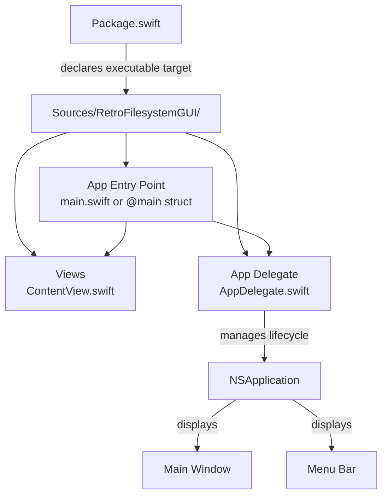

# Design Document

## Overview

This design describes a minimal macOS desktop application scaffold built with Swift and SwiftUI, managed by Swift Package Manager (SPM). The application launches a native window with standard lifecycle handling and a basic menu bar. It is intended solely for local development — no code signing, entitlements, or distribution packaging is included.

The scaffold provides a foundation that a developer can extend with custom views, services, and features while relying on familiar macOS conventions and a single `swift build` / `swift run` workflow.

## Architecture

The application follows a straightforward layered structure:



**Key architectural decisions:**

1. **SwiftUI `@main` App protocol** — The entry point uses SwiftUI's `App` protocol with the `@main` attribute. This gives us declarative window and scene management while still allowing an `NSApplicationDelegate` for fine-grained lifecycle control.

2. **NSApplicationDelegate via `@NSApplicationDelegateAdaptor`** — An explicit app delegate handles activation policy, termination logic, and lifecycle hooks that SwiftUI's `App` protocol does not expose directly.

3. **Single executable target** — SPM declares one executable target. No library targets or plugins are needed for the initial scaffold.

4. **No Xcode project file** — The project is driven entirely by `Package.swift`. Developers can open the package in Xcode (`open Package.swift`) or build from the command line.

## Components and Interfaces

### 1. Package Manifest (`Package.swift`)

Declares the executable product and target, sets the Swift tools version, and specifies the macOS deployment target.

```swift
// swift-tools-version: 5.9
import PackageDescription

let package = Package(
    name: "RetroFilesystemGUI",
    platforms: [
        .macOS(.v14)
    ],
    targets: [
        .executableTarget(
            name: "RetroFilesystemGUI",
            path: "Sources/RetroFilesystemGUI"
        )
    ]
)
```

**Rationale:**
- `macOS(.v14)` (Sonoma) ensures access to the latest SwiftUI APIs while remaining compatible with recent macOS versions.
- No external dependencies are declared initially — the scaffold depends only on system frameworks (AppKit, SwiftUI).

### 2. App Entry Point (`RetroFilesystemGUIApp.swift`)

The `@main` struct conforming to `App`. It:
- Installs the `NSApplicationDelegate` adaptor.
- Declares a `WindowGroup` scene containing the main content view.
- Sets a default window size via `.defaultSize()`.

```swift
@main
struct RetroFilesystemGUIApp: App {
    @NSApplicationDelegateAdaptor(AppDelegate.self) var appDelegate

    var body: some Scene {
        WindowGroup {
            ContentView()
                .frame(minWidth: 800, minHeight: 600)
        }
        .defaultSize(width: 800, height: 600)
        .commands {
            // Standard Edit menu commands are included by SwiftUI by default
        }
    }
}
```

### 3. App Delegate (`AppDelegate.swift`)

An `NSObject` subclass conforming to `NSApplicationDelegate`. Responsibilities:
- Set the activation policy to `.regular` (standard app with dock icon and menu bar).
- Handle `applicationShouldTerminateAfterLastWindowClosed` → return `true` so the app exits when the window is closed.
- Handle `applicationShouldTerminate` → return `.terminateNow` for graceful exit.
- Implement a safety timeout: if termination has not completed within 5 seconds, force-exit with `exit(0)`.

```swift
class AppDelegate: NSObject, NSApplicationDelegate {
    func applicationDidFinishLaunching(_ notification: Notification) {
        NSApp.setActivationPolicy(.regular)
        NSApp.activate(ignoringOtherApps: true)
    }

    func applicationShouldTerminateAfterLastWindowClosed(_ sender: NSApplication) -> Bool {
        return true
    }

    func applicationShouldTerminate(_ sender: NSApplication) -> NSApplication.TerminateReply {
        // Schedule force-termination fallback
        DispatchQueue.global().asyncAfter(deadline: .now() + 5) {
            exit(0)
        }
        return .terminateNow
    }
}
```

### 4. Content View (`ContentView.swift`)

A SwiftUI `View` struct serving as the root view rendered inside the main window. Initially displays placeholder content (e.g., app title text). This file is the developer's primary extension point for UI.

```swift
struct ContentView: View {
    var body: some View {
        VStack {
            Text("Retro Filesystem GUI")
                .font(.largeTitle)
                .padding()
        }
        .frame(maxWidth: .infinity, maxHeight: .infinity)
    }
}
```

### 5. Menu Bar

SwiftUI's `App` protocol automatically provides:
- An application menu titled with the product name (from `Package.swift` target name).
- A Quit item bound to `Cmd+Q`.
- An Edit menu with Cut (`Cmd+X`), Copy (`Cmd+C`), and Paste (`Cmd+V`).

These are standard behaviors of `WindowGroup` on macOS and do not require explicit code unless customization is needed. The `.commands` modifier can be used later to add custom menus.

## Data Models

This scaffold does not define persistent data models. There is no local database, file storage, or network layer. Future features will introduce models as needed.

The only implicit "data" is the window state managed by SwiftUI's scene system (window position, size) which macOS handles automatically via state restoration.

## Error Handling

| Scenario | Handling |
|----------|----------|
| Build compilation error | SPM exits with non-zero code and prints diagnostics to stderr. No custom handling needed — this is standard SPM behavior. |
| App fails to create window | SwiftUI's `WindowGroup` will log to console. The app remains running but with no visible UI. No custom crash handler is required for a development scaffold. |
| Termination timeout | The `AppDelegate` schedules a force-exit via `exit(0)` after 5 seconds as a safety net. |
| Missing macOS version | `Package.swift` declares `.macOS(.v14)`. Building on an older SDK produces a clear SPM error at compile time. |

No custom error types or recovery mechanisms are needed for the initial scaffold. Errors surface through standard Swift compiler diagnostics and macOS system logging (`os_log` / Console.app).

## Correctness Properties

### Property 1: Build Determinism

**Validates: Requirements 4.1**

The build output SHALL be deterministic — given the same source files and Package.swift manifest, `swift build` SHALL always produce the same compilation result (success or failure) regardless of how many times it is invoked.

**PBT Applicability:** Not testable via property-based testing. This is an invariant of the external build system (SPM), not application code. Verified manually by running `swift build` multiple times and confirming consistent exit codes.

## Testing Strategy

**PBT Assessment:** Property-based testing does not apply to this feature. The scaffold consists of UI configuration, application lifecycle events, and build system behavior — none of which involve pure functions with varying input spaces. There are no parsers, serializers, or data transformations to validate with universal properties.

**Recommended testing approach:**

### Manual Verification (Primary)
Given that this is a local development scaffold with no distribution, the primary "tests" are:
1. `swift build` exits with code 0.
2. `swift run` launches the app and a window appears.
3. The window is titled, resizable, closable, and miniaturizable.
4. Closing the window terminates the app.
5. `Cmd+Q` quits the app.
6. Edit menu items (Cut/Copy/Paste) work with system clipboard.

### Automated Smoke Tests (Optional)
If automated testing is added later:
- **Build test**: A shell script or CI job that runs `swift build` and asserts exit code 0.
- **Launch test**: A script that runs the app, waits for the process to appear, then sends a quit signal and verifies clean exit.
- **UI tests**: XCTest UI testing via Xcode to verify window properties and menu items. These require an Xcode project (generated from `Package.swift`) and a UI test target.

### Unit Tests
Not applicable for the initial scaffold — there is no business logic to unit test. As the app grows and gains services, models, or data transformations, a test target should be added to `Package.swift`:

```swift
.testTarget(
    name: "RetroFilesystemGUITests",
    dependencies: ["RetroFilesystemGUI"]
)
```
