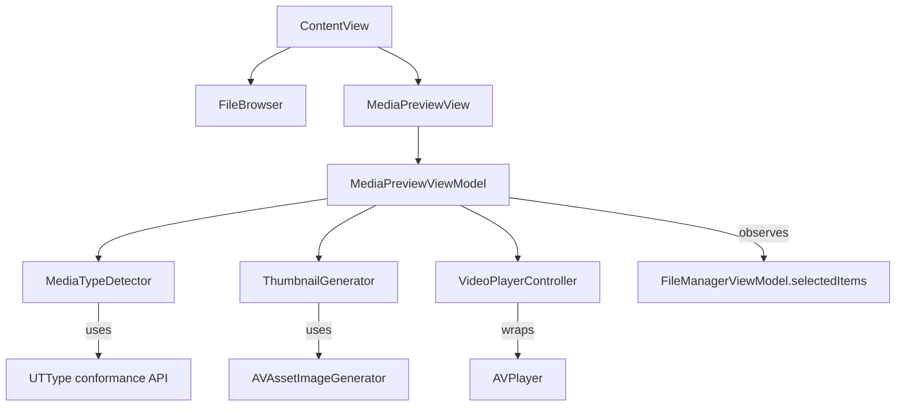
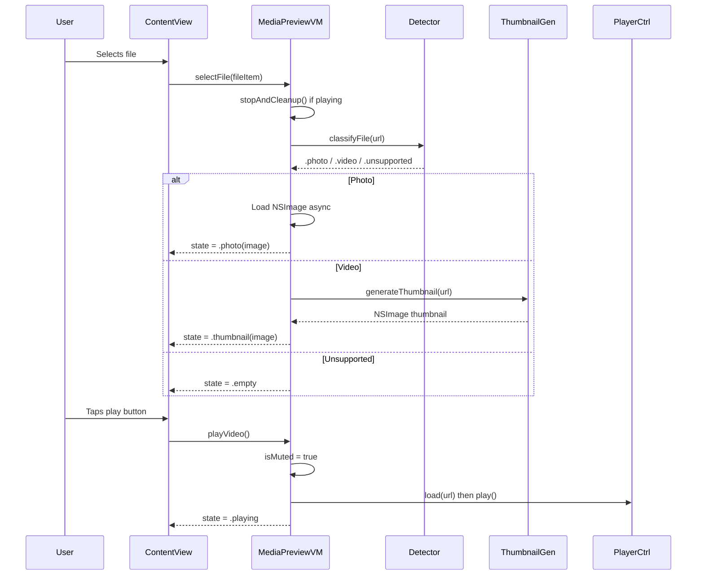
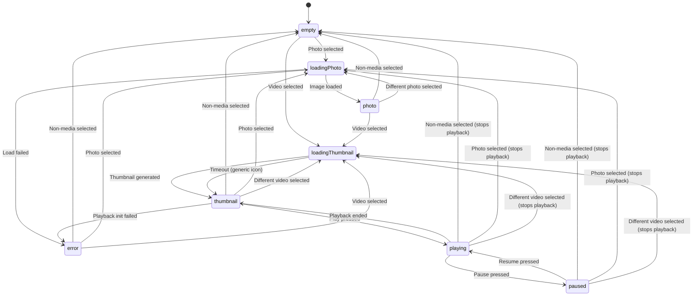

# Design Document: Media Preview Viewer

## Overview

The Media Preview Viewer adds inline media preview capability to the RetroFilesystemGUI application. When a user selects a file in the file browser, the system determines if it is a supported photo or video type via UTI conformance and displays the appropriate preview in a dedicated panel.

Photos render immediately as scaled images. Videos display a static thumbnail with a play button overlay; playback only begins when the user explicitly activates the play control. Video always starts muted, and each new playback session resets to muted state regardless of prior sessions. Playback controls (play/pause, mute/unmute) are overlaid on the video during playback.

The design follows the existing project conventions: MVVM architecture with `@Observable` view models, protocol-based services for testability, and SwiftUI views composed into the existing `ContentView` layout.

## Architecture

The design follows the project's established MVVM pattern using Swift's `@Observable` macro. A dedicated view model manages the preview lifecycle independently of the main `FileManagerViewModel`, communicating through the shared file selection state.



**Key architectural decisions:**

1. **Separate ViewModel**: `MediaPreviewViewModel` is independent from `FileManagerViewModel` to keep concerns separated. It observes the selected file and manages its own lifecycle.

2. **Protocol-based services**: `MediaTypeDetecting` and `ThumbnailGenerating` protocols enable testability by allowing mock implementations in unit tests.

3. **State machine for video**: Video preview uses an explicit state machine (`idle → thumbnail → playing → paused → idle`) to prevent invalid transitions and ensure resources are properly managed.

4. **AVPlayer wrapping**: The `VideoPlayerController` wraps AVFoundation's `AVPlayer` behind a protocol to isolate platform-specific media playback from testable business logic.

### Data Flow



## Components and Interfaces

### MediaTypeDetector

Responsible for classifying files by their UTI conformance.

```swift
protocol MediaTypeDetecting {
    func classifyFile(at url: URL) -> MediaType
}

enum MediaType: Equatable {
    case photo
    case video
    case unsupported
}

struct MediaTypeDetector: MediaTypeDetecting {
    static let supportedImageTypes: Set<String> = [
        "public.jpeg", "public.png", "public.heic",
        "public.tiff", "com.compuserve.gif", "public.webp"
    ]
    
    static let supportedVideoTypes: Set<String> = [
        "public.mpeg-4", "com.apple.quicktime-movie",
        "public.avi", "public.webm"
    ]
    
    func classifyFile(at url: URL) -> MediaType {
        // Uses UTType(filenameExtension:) and conforms(to:) hierarchy
    }
}
```

### ThumbnailGenerator

Generates static thumbnail images for video files.

```swift
protocol ThumbnailGenerating {
    func generateThumbnail(for url: URL) async throws -> NSImage
}

struct ThumbnailGenerator: ThumbnailGenerating {
    /// Generates a thumbnail from the first frame of a video file.
    /// Throws ThumbnailError.timeout if generation exceeds 5 seconds.
    /// Throws ThumbnailError.generationFailed if AVAssetImageGenerator fails.
    func generateThumbnail(for url: URL) async throws -> NSImage
}

enum ThumbnailError: Error {
    case timeout
    case generationFailed(underlying: Error)
}
```

### VideoPlayerController

Manages AVPlayer lifecycle and playback state.

```swift
protocol VideoPlayerControlling: AnyObject {
    var isPlaying: Bool { get }
    var isMuted: Bool { get set }
    var hasAudioTrack: Bool { get }
    var onPlaybackEnded: (() -> Void)? { get set }
    
    func load(url: URL) async throws
    func play()
    func pause()
    func stop()
}

class VideoPlayerController: VideoPlayerControlling {
    private var player: AVPlayer?
    private var playerItem: AVPlayerItem?
    private var endObserver: Any?
    
    var isPlaying: Bool = false
    var isMuted: Bool = true { didSet { player?.isMuted = isMuted } }
    var hasAudioTrack: Bool = false
    var onPlaybackEnded: (() -> Void)?
    
    func load(url: URL) async throws { /* Creates AVPlayerItem, checks audio tracks */ }
    func play() { player?.play(); isPlaying = true }
    func pause() { player?.pause(); isPlaying = false }
    func stop() { player?.pause(); player = nil; playerItem = nil; isPlaying = false }
}
```

### MediaPreviewViewModel

Central view model managing preview state and coordinating sub-components.

```swift
@Observable
class MediaPreviewViewModel {
    // MARK: - State
    enum PreviewState: Equatable {
        case empty
        case loadingPhoto
        case photo(NSImage)
        case loadingThumbnail
        case thumbnail(NSImage)
        case playing
        case paused
        case error(String)
    }
    
    private(set) var state: PreviewState = .empty
    private(set) var isMuted: Bool = true
    
    // MARK: - Dependencies
    private let mediaTypeDetector: MediaTypeDetecting
    private let thumbnailGenerator: ThumbnailGenerating
    private let playerController: VideoPlayerControlling
    
    // MARK: - Internal
    private var currentFileURL: URL?
    private var currentThumbnail: NSImage?
    private var loadTask: Task<Void, Never>?
    
    // MARK: - Actions
    func selectFile(_ fileItem: FileItem?) { }
    func playVideo() { }
    func pauseVideo() { }
    func resumeVideo() { }
    func toggleMute() { }
    func stopAndCleanup() { }
}
```

### SwiftUI Views

| View | Responsibility |
|------|---------------|
| `MediaPreviewView` | Top-level container; switches on `viewModel.state` to render correct subview |
| `PhotoPreviewView` | Renders `NSImage` scaled to fit with aspect ratio preserved |
| `VideoThumbnailView` | Shows thumbnail image with centered play button overlay |
| `VideoPlaybackView` | Wraps `AVPlayerView` via `NSViewRepresentable` with playback controls |
| `PlaybackControlsOverlay` | Semi-transparent bar with play/pause and mute/unmute buttons |

### ScaledImageView / computeScaledSize

A pure utility function for computing scaled dimensions while preserving aspect ratio:

```swift
/// Computes the display size that fits imageSize within containerSize
/// while preserving the original aspect ratio.
func computeScaledSize(imageSize: CGSize, containerSize: CGSize) -> CGSize
```

## Data Models

### MediaType

```swift
enum MediaType: Equatable {
    case photo
    case video
    case unsupported
}
```

### PreviewState

```swift
enum PreviewState: Equatable {
    case empty
    case loadingPhoto
    case photo(NSImage)
    case loadingThumbnail
    case thumbnail(NSImage)
    case playing
    case paused
    case error(String)
}
```

### State Machine Transitions



### Mute State Rules

- `isMuted` is always reset to `true` when `playVideo()` is called (new session)
- `isMuted` is preserved across `pauseVideo()` / `resumeVideo()` transitions
- `toggleMute()` on a video with no audio track is a no-op (stays muted)


## Correctness Properties

*A property is a characteristic or behavior that should hold true across all valid executions of a system — essentially, a formal statement about what the system should do. Properties serve as the bridge between human-readable specifications and machine-verifiable correctness guarantees.*

### Property 1: UTI Classification Correctness

*For any* file URL, the `classifyFile` function shall return `.photo` if and only if the file's UTI conforms to a supported image type (public.jpeg, public.png, public.heic, public.tiff, com.compuserve.gif, public.webp), `.video` if and only if it conforms to a supported video type (public.mpeg-4, com.apple.quicktime-movie, public.avi, public.webm), and `.unsupported` otherwise. The classification forms a complete partition — every file maps to exactly one category.

**Validates: Requirements 6.2, 6.3, 6.4**

### Property 2: Aspect Ratio Preservation

*For any* image dimensions (width > 0, height > 0) and any container dimensions (width > 0, height > 0), the `computeScaledSize` function shall return dimensions that maintain the original aspect ratio (within floating-point tolerance) and fit entirely within the container bounds without exceeding either dimension.

**Validates: Requirements 1.2, 2.1**

### Property 3: Video Never Auto-Plays

*For any* video file selection event, the preview state shall transition to `.thumbnail` (or `.loadingThumbnail`) and shall NOT transition to `.playing` without an explicit user `playVideo()` call.

**Validates: Requirements 2.2**

### Property 4: Every Playback Session Starts Muted

*For any* sequence of play/unmute/select-new-video/play actions across any number of video files, each invocation of `playVideo()` shall set `isMuted` to `true`, regardless of the mute state from any prior playback session.

**Validates: Requirements 3.1, 4.4**

### Property 5: Selection Change Stops Playback and Replaces Preview

*For any* state where video is playing or paused, calling `selectFile` with a different file shall stop playback (state is no longer `.playing` or `.paused`), release the player controller, and display only the newly selected file's preview.

**Validates: Requirements 1.4, 2.5, 3.5, 5.5**

### Property 6: Mute Toggle Inverts State

*For any* video in the `.playing` state where the video has an audio track, calling `toggleMute()` shall invert the current `isMuted` value: if `isMuted` was `true`, it becomes `false`, and vice versa.

**Validates: Requirements 4.2, 4.3**

### Property 7: Pause and Resume Preserve Mute State

*For any* video in the `.playing` state with any `isMuted` value, calling `pauseVideo()` followed by `resumeVideo()` shall preserve the `isMuted` value that existed before the pause, and the state shall transition through `.paused` back to `.playing`.

**Validates: Requirements 5.2, 5.3**

### Property 8: End of Playback Returns to Thumbnail State

*For any* video that reaches the end of its content during playback, the preview state shall transition to `.thumbnail` with the original thumbnail image, and `isPlaying` shall be `false`.

**Validates: Requirements 5.4**

## Error Handling

| Scenario | Behavior | State Transition |
|----------|----------|-----------------|
| Photo file cannot be loaded (corrupted, permissions) | Display error indicator; clear any previous image | → `.error("Unable to load image")` |
| Video thumbnail generation fails or times out (5s) | Display generic video file icon with play button | → `.thumbnail(genericIcon)` |
| Video playback initiation fails (codec, corrupted) | Display error indicator; no blank/loading state | → `.error("Unable to play video")` |
| File not accessible or no determinable UTI | Treat as unsupported; show empty preview | → `.empty` |
| File selection during active playback | Stop playback, release AVPlayer, load new file | → `loadingPhoto` or `loadingThumbnail` |

**Error recovery:**
- Selecting a new valid file from any error state transitions normally
- Error indicators use an SF Symbol (`exclamationmark.triangle`) with a brief message
- No automatic retry — user re-selects the file to retry

**Resource management:**
- `AVPlayer` and `AVPlayerItem` are released when: a different file is selected, playback ends, or the preview panel is hidden
- Async image loading tasks are cancelled via `Task.cancel()` when a new file is selected
- Thumbnail generation enforces a 5-second timeout to prevent indefinite resource consumption

## Testing Strategy

### Unit Tests (Example-Based)

Unit tests cover specific scenarios, edge cases, and integration points:

- **MediaTypeDetector**: Verify specific UTI strings (e.g., "public.jpeg" → `.photo`, "public.mpeg-4" → `.video`)
- **State transitions**: Test specific sequences (select photo → select video → verify state)
- **Error states**: Corrupt file → `.error`, thumbnail timeout → generic icon
- **Edge cases**: Video with no audio track (unmute is no-op), rapid selection changes, non-media files
- **computeScaledSize**: Verify specific dimension calculations

### Property-Based Tests

Property-based testing is appropriate for this feature because:
- `MediaTypeDetector.classifyFile` is a pure function mapping UTIs to `MediaType`
- `computeScaledSize` is a pure function with clear mathematical properties
- The state machine has universal invariants (never auto-play, always start muted, selection replaces)
- Mute toggle and pause/resume are simple stateful properties

**Library**: swift-testing with custom random generators (using `SystemRandomNumberGenerator` for input generation within parameterized tests). If SwiftCheck becomes available in the SPM dependency graph, prefer it for richer shrinking support.

**Configuration**: Minimum 100 iterations per property test.

**Tag format**:
```swift
// Feature: media-preview-viewer, Property {N}: {property title}
```

**Properties mapped to tests:**

| Property | Test Strategy |
|----------|--------------|
| 1: UTI Classification | Generate random UTIs from supported + unsupported pools; verify partition correctness |
| 2: Aspect Ratio | Generate random image/container sizes; verify ratio preserved and bounds respected |
| 3: No Auto-Play | Generate random video selections; verify `.playing` never reached without `playVideo()` |
| 4: Starts Muted | Generate action sequences (play, unmute, new video, play); verify each play resets mute |
| 5: Selection Stops | Generate random playing/paused states + new selection; verify stop + replace |
| 6: Mute Toggle | Generate random mute values for playing videos; verify toggle inverts |
| 7: Pause/Resume | Generate random mute states; pause then resume; verify mute unchanged |
| 8: End Returns Thumbnail | Simulate end notification for random video states; verify thumbnail state |

### Integration Tests

- End-to-end: load a real JPEG file → verify `NSImage` produced and state is `.photo`
- End-to-end: load a real MP4 → tap play → verify playback starts muted
- Performance: verify photo loads within 1 second, thumbnail within 3 seconds on representative files
- Resource cleanup: verify `AVPlayer` is deallocated after `stopAndCleanup()`
